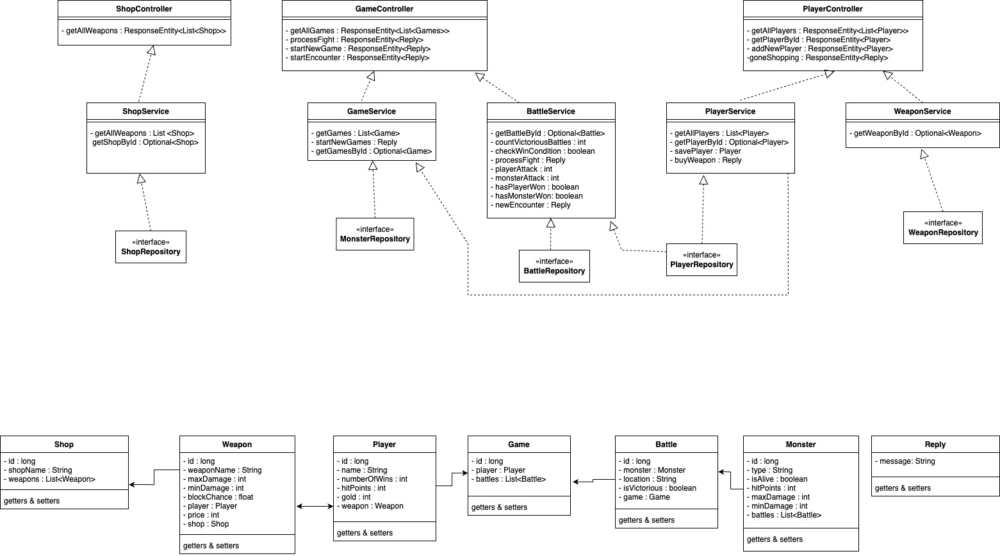
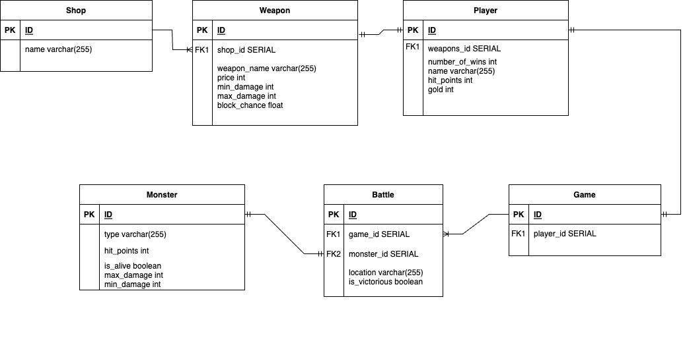

# Adventure Game API

A nail-biting fantasy adventure, in a world full of dangerous creatures!

Set out on an action packed quest with the hero Frodo as he journeys through forests, mountains and caves, as he battles deadly monsters for their gold to acquire the strongest weapon and defeat the mighty troll.


# Project Overview

Bright Network Technology Academy have tasked the team at Electronic Otters (EO Games) to produce an API which uses Spring boot and SQL within Java, so the team have embarked on a new project to deliver an exciting text-based adventure game with turn based combat against monsters.

# Table of Contents 

- [Setup](#setup)
- [How to play](#how-to-play)
- [Project structure](#project-structure)
- [Further extensions / considerations](#further-extensions--considerations)


# Setup 


1. First ensure that Java 17 is installed to run the game.
2. Clone this repository by clicking the green 'code' sign on top of this page. Click the SSH key and type in your terminal the following: git clone "the SSH key".
3. Open up and run the file in IntelliJ.
4. Open up Postman to start the requests.

# How to play

1. First create a Post request for a new player. 

   The request body should look like this:
   
   ```{"name":"frodo"}```
2. Create a post request for a new game 
3. send a GET request to the shop to see all weapons.
4. send a patch request to the player to buy a weapon
5. to start a battle send a GET request  
6. To attack the monster send a PATCH request
7. After defeating the monster, feel free to head back to the shop, or start a new battle.

## Request Paths:

| HTTP Request Paths | Request Type | Description |
|:---:|:---:|:---:|
| .../players? | POST | Post the player |
| .../players | GET | Gets the player |
| .../players/1 | GET | Gets the player by their ID |
| .../games?playerId=1 | POST | Posts a new game by their ID |
| .../shops | GET | Shows the shop |
| .../players?playerId=1&weaponId=1 | PATCH | Allows player to buy a weapon |
| .../games | GET | Gets the game |
| .../games/combat?battleId=1 | GET | Gets the player to start the battle  |
| .../games/1?battleId=1 | PATCH | Gets the player to attack |


## Postman:

(pic)

Using postman we can ensure that our game runs as we initially planned. We can use http requests to get automated responses. It is also our way of testing each command and debugging where necessary.


# Project structure

<p align="center">
###**The UML Diagram for our Project**###
</p>



<p align="center">
###**The ERD Diagram for our Project**###
</p>



# Further extensions / considerations

- Currently, only one game can be running at a time. This could be 

- To make the game more interactive, our nexte extension would have been to provide the player the option to "block" as well as "attack"

